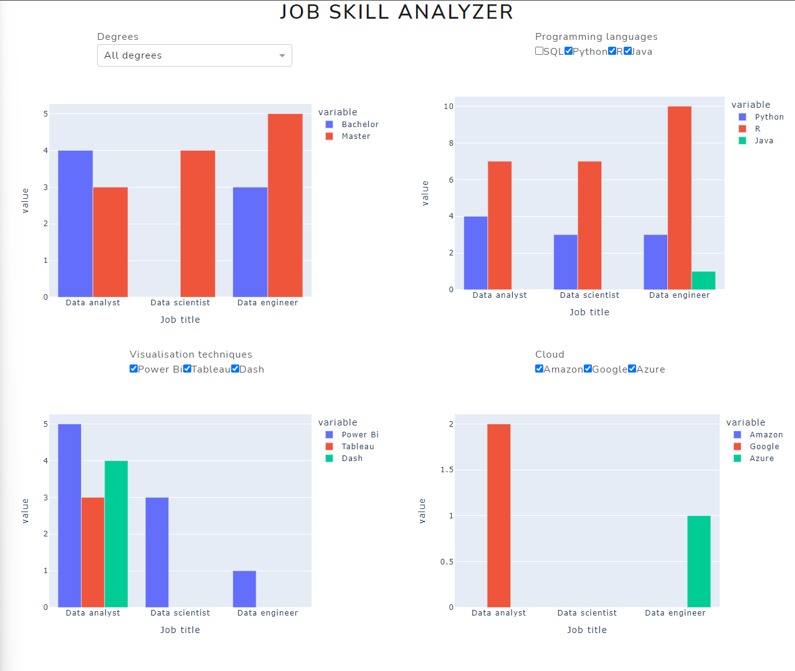

# Job skill analysis

#### Project to visualize and analyse skills required for certain jobs.

I was curious what the most required skills where for data analysts/ data scientists/ data engineers.
So I made a webscraper to scrape the linkedIn job page with the requests and bs4 python modules.
The findings where then displayed in a dash by plotly dashboard.

This project was mainly to get an overview of the skills required in data jobs and to practice dash.

